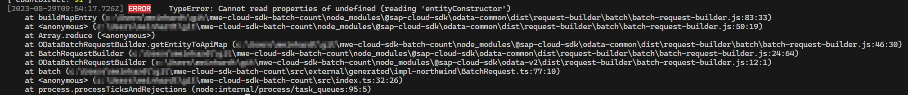

# MWE Cloud SDK issue #4080

This repository contains a MWE for the issue [Execute \$count in Batch request](https://github.com/SAP/cloud-sdk-js/issues/4080).

The Northwind OData v2 service is used as an example.

## Structure

- `http/` contains test HTTP requests (for VS Code extension "REST Client")
- `service-specs/` contains the OData client required files
- `src/` contains a simple script that issues two `$count` requests, and the generated OData client

## Usage

- `npm i` to install dependencies
- `npm run generate-client` (or Ctrl+Shift+B in VS Code) to generate the OData client (should run automatically after installing)
- `npm start` (or F5 in VS Code) to start the script

## About the script

The script executes two `$count` requests:

- the first one is executed directly (without `$batch`)
  - it works as expected
  - have to remove the `accept` header as Northwind does not accept `application/json`
- the second one is contained inside a `$batch` request.
  - this one fails
  - have to disable TS checks; else it complains about the `CountRequestBuilder` not matching the `batch` signature (which only accepts `GetByKeyRequestBuilder`, `GetAllRequestBuilder`, and `BatchChangeSets `)
  - when running the script you get a runtime error:  
    
  - in the `http` test requests you can see that the server does accept `$count` in `$batch`
